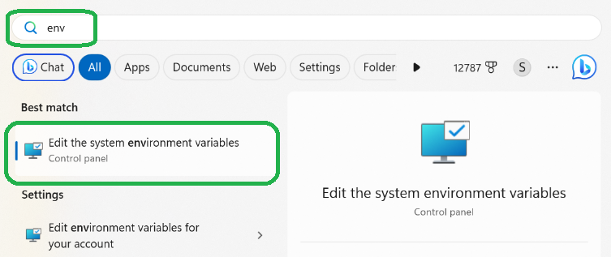
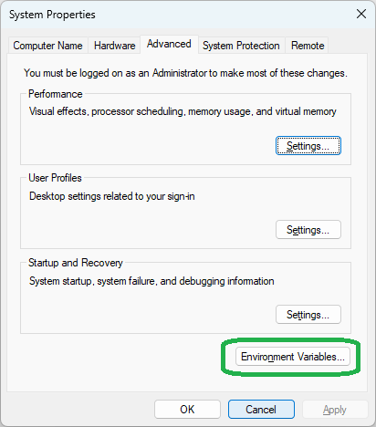
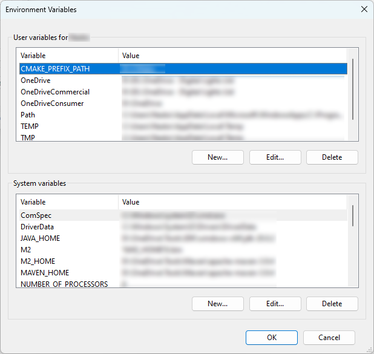
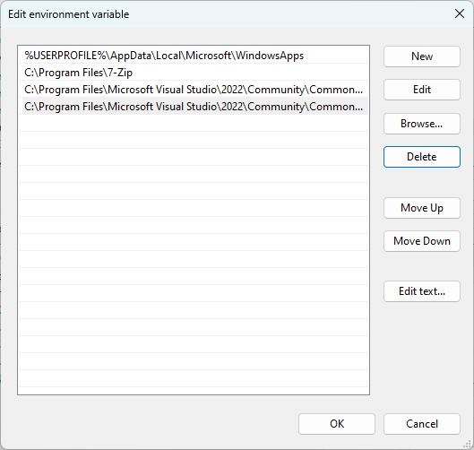

# Environment variables

## References

For more information check one of the following resources:

* [What are PATH and other environment variables, and how can I set or use them?](https://superuser.com/questions/284342/what-are-path-and-other-environment-variables-and-how-can-i-set-or-use-them) | Stack Exchange

* [PATH HOWTO](https://tldp.org/HOWTO/Path.html) | Esa Turtiainen

* [Environment variable](https://en.wikipedia.org/wiki/Environment_variable) | Wikipedia

* [What exactly is an environment variable?](https://unix.stackexchange.com/questions/91282/what-exactly-is-an-environment-variable) | Stack Exchange

* [How to Set and List Environment Variables in Linux](https://linuxize.com/post/how-to-set-and-list-environment-variables-in-linux/) | Linuxize

## Introduction

Similarly to how you use variables in your program, your OS maintains a set of variables to store useful data.

On Windows and Linux there may be different types of variables. For example:

* A set of variables, which applies to all users on the system. Each variable in this set is available to all users.
* A personal set of variables for each user of the system. A variable, which is set for one user is only visible to that user.

Typically, variables contain string values and it is up to the program that uses them to determine what to do with their value. For example, it can be converted to a number, split into multiple values, etc.

On Windows and Linux, when a process starts, it receives a copy of all variables available at this time:

* When a process is started within the session of a given user, this process receives both the system variables and the user variables.
* If there is a variable with the same name in the system and the user sets, then it may be combined in one variable which contains all values. For example, you may have both a system and a user `PATH` variables, that both get combined into one joint list of directories.

Please, note that when a process starts, it receives a copy of the values of the environment variables available to it at this time. These values are NOT updated in real time. Thus, if you change an environment variable, the processes that are already running will not see the change. Processes that start running after the change will receive a copy of the new value.

In practice, this typically means that if a program is already running by the time you change an environment variable and you want that program to see the change, you will have to restart it.

Also, note that depending on your system, the names of the environment variables may, or may not be case-sensitive.

Further on, an environment variable may be temporary or persistent. A temporary variable is created during a specific session and does not persist after it ends. A persistent variable is typically stored in the configuration of the system and is recreated every time.

## Where are the environment variables stored and how to edit them?

### Linux

The variables are persisted into different configuration files. The name and location may vary between distributions. For example:

* `/etc/environment` for system variables
* `/etc/profile` for variables loaded whenever a bash login shell is entered.
* `/etc/bash.bashrc` for system wide interactive bash shells.
* `~/.bashrc` or `~/.bash_profile` or `~/.profile` for user variables, if you are using bash

Please, refer to the following articles for more information:

* <https://linuxize.com/post/how-to-set-and-list-environment-variables-in-linux/#persistent-environment-variables>
* <https://superuser.com/questions/664169/what-is-the-difference-between-etc-environment-and-etc-profile>
* <https://askubuntu.com/questions/142354/is-there-a-gui-to-edit-the-path-variable>

To set an environment variable, edit the appropriate configuration file. The change will not take effect immediately. For example, if you edit the file for your user and want to bring its values to the current session, you can use the [`source` command](https://linuxize.com/post/bash-source-command/):

```bash
source ~/.bashrc
```

### Windows

Environment variables are stored in the registry. However, it is recommended to set them up through the provided instrumentation instead of editing the registry directly.

One option is to use the GUI, as described below. Another is to [use Group Policy](https://morgantechspace.com/2013/10/add-environment-variable-via-group.html). You can also look up the different APIs, e.g. [the functions in the Win API](https://learn.microsoft.com/en-us/windows/win32/procthread/changing-environment-variables) or [the PowerShell Cmdlets](https://learn.microsoft.com/en-us/powershell/module/microsoft.powershell.core/about/about_environment_variables).

1. Open the Start menu and start typing _"environment variable"_. When the "`Edit the system environment variables`" item appears, open it.


1. Click the `[Environment variables...]` button.  


1. Inside the "Environment Variables" dialog there are two lists. One with the variables for the current user and one with the system variables. Under each set you will find a set of buttons that allow you to add a new variable (the `[New...]` button), edit the value of an existing one (`[Edit...]`), or remove the selected variable (`[Delete]`).


## Notable variables

### PATH

This variable stores a list of directories of interest. They may be searched by the system, or by an application, when they are trying to resolve the location of a given resource (a file or a directory).

The typical use case for `PATH` is trying to locate an executable that the user wants to run. If the user specifies the executable with an absolute path, the system loads it from that exact location. However, if the program was specified with a relative path and the system cannot resolve it against the current working directory, it will try to do so against each of the directories listed in `PATH`.

For example, imagine that:

* the `PATH` variable for the system contains the following directories:
  * `C:\dir1\`
  * `C:\dir2\subdir\`
* the `PATH` variable for the current user contains the following:
  * `C:\dir3\`
* the user tries to run a program called `program.exe`
* the program is NOT located inside the current working directory

The system may try to solve this case by going through the directories on `PATH` and trying to resolve the relative path against each of them:

* `C:\dir1\program.exe`
* `C:\dir2\subdir\program.exe`
* `C:\dir3\program.exe`

As it goes through that list, when the system first encounters a file called `program.exe` inside one of the directories, it will stop searching and use that entry. Otherwise it proceeds with the search.

Thus, it is possible to have many programs called `program.exe` within the directories, but only the first one that is found during a search will be used.

In Linux the entries stored in the `PATH` variable are separated by colons:

    C:\dir1\:C:\dir2\subdir\:C:\dir3

In Windows the separator is a semi-colon. For example:

    C:\dir1\;C:\dir2\subdir\;C:\dir3

If you use the GUI in Windows, when you try to edit the `PATH` variable, a special editor appears, that makes it easier to work with the entries. If you want to work with the exact value that will be stored in the variable, click on the `[Edit text...]` button.


