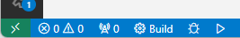

# Setup and use Visual Studio Code for C++ development with CMake

## References

* [CMake Tools for Visual Studio Code documentation](https://github.com/microsoft/vscode-cmake-tools/blob/main/docs/README.md) | Microsoft

* [Get started with CMake Tools on Linux](https://code.visualstudio.com/docs/cpp/CMake-linux) | Microsoft

## Extensions

1. Start Visual Studio Code

1. Go to the **Extensions** sidebar.

1. Search for and install the extensions listed below. They are listed with their IDs, names and authors. It is recommended to search for the extensions by ID, as there may be multiple extensions with the same name.

    * [`ms-vscode.cpptools-extension-pack`](https://marketplace.visualstudio.com/items?itemName=ms-vscode.cpptools-extension-pack) – C/C++ Extension pack by Microsoft

    * [`fredericbonnet.cmake-test-adapter`](https://marketplace.visualstudio.com/items?itemName=fredericbonnet.cmake-test-adapter) – CMake Test Explorer by Frédéric Bonnet

    * [`hbenl.vscode-test-explorer`](https://marketplace.visualstudio.com/items?itemName=hbenl.vscode-test-explorer) – Test Explorer UI by Holger Benl

## Build a CMake project

1. Open the project by choosing `File` > `Open Folder...` from the menu(`Ctrl+K` `Ctrl+O`)..

1. Wait for the project to load. After a while the **CMake Tools** sidebar will appear. On it you will find the **"Project status"** pane. When you hover over an entry in the pane, a pencil icon will appear. You can click on it to modify the settings for that entry.  

1. In the **"Project status"** pane, under **"Configure"** select:

    * the Kit you want to use (`amd64`, `amd64_x86`, `x86` or `x86_amd64`)
    * the build variant (`Debug`, `Release`, `MinSizeRel` or `RelWithDebInfo`).

1. After you select the kit and build variant, CMake generation will begin. You can monitor the progress in the Output window:  

1. When generation is finished, you can find the project's targets and `CMakeLists.txt` files in the **"Project outline"** pane.  

1. Back in the **"Project status"** pane you can configure:

    * What target you want to build (under **Build**).
    * What is the launch target, i.e. what will be launched when you click the play or debug icons (under **Debug**/**Launch**).

1. From the status bar you can build the project or launch your chosen target:  

    *  To build your chosen target, click the Build icon or press `[F7]`. 

    *  To launch the chosen target, click the "Play" icon.

    *  To debug the project, click the "Bug" icon.

## CTest

First, make sure you have successfully (1) generated the build files and then (2) have built the project.

Open the **Testing** sidebar. You will see two panes called **"Test explorer"** (you can work with either one).

Right now the panes in your project are probably empty. Use the reload icon to load the tests in the pane. In the screenshots below we have clicked both of the reload buttons to load the tests in both panes:

After all unit tests have been successfully loaded, they will be listed in the pane. When you hover over a test, two icons will appear:

* A play button, which launches this individual test.
* A bug button, which launches the test in debug mode.

There is also a play button on the top of the list, which can be used to run all tests.

All tests that have passed successfully are marked with a green icon. The ones that failed are marked with red.

