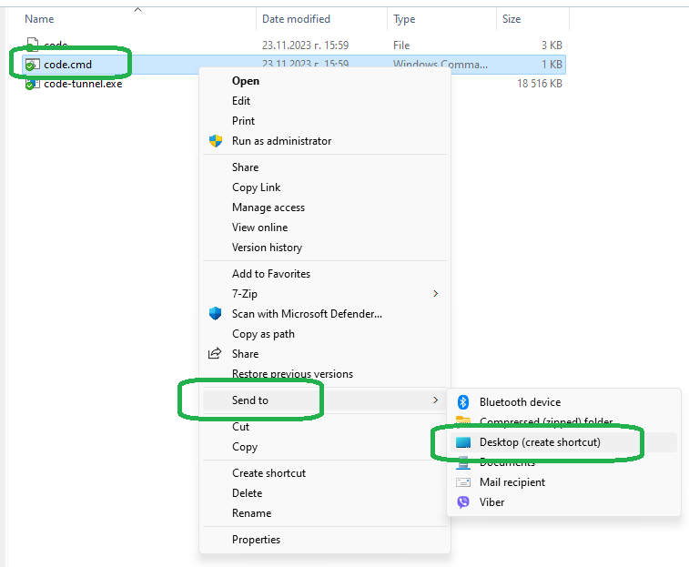

# Visual Studio Code portable

## Download and set up the latest version

Follow the steps in the official guide to download and set up Visual Studio Code in portable mode:

* <https://code.visualstudio.com/docs/editor/portable>

In the text below we'll call the directory where you extracted Visual Studio Code the *installation directory*. This is how it may look like in Windows (note the manually-added `data/` directory):


### Tip 1

You may want to organize all of your portable applications and stand-alone tools in a single directory. For example, on Windows, you may want to place them inside:

* `D:\portable\`
* `C:\Tools\`
* `C:\My Portable Apps\`
* etc.

### Tip 2

If you are using a service like OneDrive, Dropbox, etc., you may want to keep all of your portable tools there.

### Tip 3

There are two directory layouts that you may find useful. Layout 1 is easier to create, maintain and update, while Layout 2 will allow you to keep multiple versions installed, but is a bit more difficult to setup and use.

Before choosing a layout, also check the [How to update Visual Studio Code portable](#update) section for more information on how updating looks like for each of them.

**Layout 1:** The easier option is to simply keep the latest version in a single directory. If you want to keep an older version, you can keep it as a sibling, probably with some sort of suffix (e.g. `.old`). For example you can have your Visual Studio Code at:

* `C:\Tools\vscode\`

and also keep an older version at:

* `C:\Tools\vscode.old\`

**Layout 2:** Create a main directory and inside of it – a subdirectory for each version you want to keep. This will allow you to keep both older and newer versions at the same time. It will also allow you to fallback to an older version if there are problems with the latest release. For example, on Windows you can have something like:

* `C:\Tools\vscode\VSCode-win32-x64-1.81.1\`
* `C:\Tools\vscode\VSCode-win32-x64-1.83.1\`
* `C:\Tools\vscode\VSCode-win32-x64-1.84.2\`
* etc.

This approach has the drawback that every time you download a new version you must also update all shortcuts, the `PATH` variable, etc.

A possible way to work around those limitations is to create a soft link and make it point to the current version. In the example below we have named the soft link `current`. You point all shortcuts to the soft link instead of the actual directory, which contains the files. You also use that for the `PATH` variable. After each update, you alter the soft link to point to the newly-downloaded version. As all shortcuts and `PATH` use the soft link, they will not need to be updated manually. The directory structure may look like this:

```
C:\
└─── Tools
     └─── vscode
          ├─── current (soft link, points to VSCode-win32-x64-1.84.2/)
          ├─── VSCode-win32-x64-1.81.1
          ├─── VSCode-win32-x64-1.83.1
          └─── VSCode-win32-x64-1.84.2
```

And, respectively, `C:\Tools\vscode\current` should be added to `PATH`, instead of the actual directory.

To create a new soft link, refer to the section relevant to your system:

**Linux:** In the example below we are assuming that a layout similar to the one above is being used, with vscode versions being kept in `/portable/vscode`, and we want to create a soft link to `VSCode-win32-x64-1.84.2/`.

Use the [`ln` command](https://www.howtogeek.com/287014/how-to-create-and-use-symbolic-links-aka-symlinks-on-linux/) to create the soft link:

```bash
ln -s /portable/vscode/VSCode-win32-x64-1.84.2 /portable/vscode/current
```

**Windows:** In the example below we are assuming that the layout of the directories is as described in the example above and we want to create a soft link to `VSCode-win32-x64-1.84.2\`.

The operations below need to be performed with administrative rights. To do that start either Command Prompt or PowerShell as Administrator.

If you are using PowerShell, use the [`New-Item` Cmdlet](https://learn.microsoft.com/en-us/powershell/module/microsoft.powershell.management/new-item?view=powershell-7.3):

```powershell
cd C:\Tools\vscode
New-Item -Path current -ItemType SymbolicLink -Value VSCode-win32-x64-1.84.2
```

If you are using Command Prompt, use the [mklink command](https://learn.microsoft.com/en-us/windows-server/administration/windows-commands/mklink):

```bash
C:
cd \Tools\vscode
mklink /d current VSCode-win32-x64-1.84.2
```

## Recommended steps

### Add Visual Studio Code to PATH

Add Visual Studio Code's installation directory to the PATH environment variable.

This will make it easier to launch it from a command interpreter, to add it to the configuration of different tools, etc.

[You can find our guide on how to do that here](../Environment%20variables/).

## Optional steps

### I want to have a shortcut to Visual Studio Code on my desktop in Windows

1. Go to the installation directory.
2. Right click Visual Studio Code's executable (`Code.exe`).
3. If you are on Windows 11, choose `Show more options` from the context menu.
4. Choose `Send To` > `Desktop (create shortcut)`.



### I want to have a shortcut to Visual Studio Code in my Start menu

1. Open Windows Explorer (`[Win]`+`[E]`)
1. Copy the line below, paste it in the address bar of Windows Explorer and press `[Enter]`:
`%appdata%\Microsoft\Windows\Start Menu\Programs`
1. Inside the folder you will see some of the items that appear on your Start menu. You can add your own items or remove existing ones. In his case we will add a shortcut to Visual Studio Code.
1. Right-click anywhere in the blank space.
1. Choose `New` > `Shortcut` from the context menu.
1. In the "Create shortcut" dialog click the `[Browse]` button.
1. Navigate to the installation directory and select Visual Studio Code's executable (`Code.exe`). Press the `[OK]` button and finish the final steps of the shortcut creation wizard.

<div id="update" />

## How to update Visual Studio Code portable

### macOS

The official documentation states that:

> On macOS, automatic updates should work as always, no extra work needed.

So, you can use that to update your portable installation.

### Windows, Linux

To update Visual Studio Code portable, you simply need to download the new version, extract it and then copy/move your `data/` folder to the new location.

#### If you are using Layout 1

The steps for this layout are simple.

In the tutorial below we'll assume that Visual Studio Code has been extracted to `C:\Tools\vscode\`.

1. Rename the current directory from `vscode\` to `vscode.old\`.

1. Download the new version. Create a new directory called `vscode\` and extract the archive there.

1. You will end with two directories:
    * `C:\Tools\vscode.old\` -- the old version
    * `C:\Tools\vscode\` -- the version you just downloaded

1. Copy the `data\` directory from the old directory to the new one.

1. Start the new version of Visual Studio Code to confirm that everything works correctly, all extensions are there, etc.

1. If everything works correctly, you can delete the old version.

In this scenario there should be no need to update the `PATH` variable, nor any shortcuts, as the new version has the exact same layout as the previous one.

#### If you are using Layout 2

1. Download the new version from [Visual Studio Code's download page](https://code.visualstudio.com/download).

1. Extract it to a subdirectory corresponding to the version you just downloaded. In the example below, this is `VSCode-win32-x64-1.84.2\`.

1. Now copy the `data\` directory from the version of Visual Studio Code you were last using.


1. Start the new version to confirm that everything works correctly, all extensions are there, etc.

1. If all is OK and you don't need the old version anymore, you can proceed to delete it.

1. Depending on how you have set up your layout, you may need to perform one of these steps:

    * *If you are NOT using a soft link:* If you have added Visual Studio Code to the `PATH` variable and/or have created shortcuts on your Desktop and/or Start menu, you will need to manually update them to point to the new version.

    * *If you are using a soft link:* Simply update the soft link to point to the newly-created directory. To do that, simply delete the old soft link and recreate it, this time pointing to the new version.
